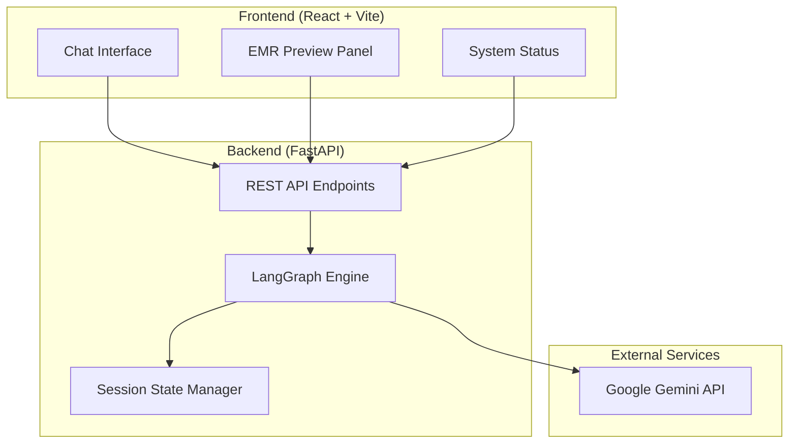
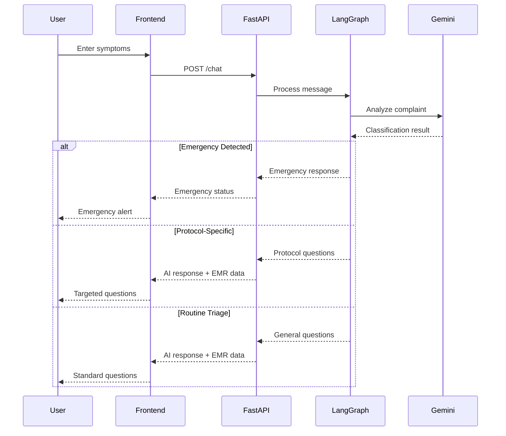

# Design Document

## Overview

The AI Triage System is a full-stack web application that demonstrates intelligent patient triage using conversational AI. The system consists of a React frontend with a professional chat interface and a Python FastAPI backend powered by LangGraph for AI orchestration. The application uses Google Gemini API for natural language processing to classify patient complaints, follow appropriate medical protocols, detect emergencies, and generate structured EMR data.

## Architecture

### High-Level Architecture



### System Flow



## Components and Interfaces

### Frontend Components

#### 1. ChatLayout Component
- **Purpose**: Main container component managing layout and state
- **Props**: None (root component)
- **State Management**: 
  - `messages`: Array of conversation messages
  - `emrData`: Current EMR data object
  - `systemStatus`: Current triage status
  - `isLoading`: Loading state for API calls
  - `isEmergency`: Emergency detection flag

#### 2. MessageBubble Component
- **Purpose**: Renders individual chat messages
- **Props**:
  - `message`: Message object with content, sender, timestamp
  - `isUser`: Boolean to distinguish user vs AI messages
- **Styling**: Different styles for user (right-aligned, blue) vs AI (left-aligned, gray)

#### 3. ChatInput Component
- **Purpose**: Input field and send button for user messages
- **Props**:
  - `onSendMessage`: Callback function for message submission
  - `disabled`: Boolean to disable input during emergencies
- **Features**: 
  - Enter key submission
  - Character limit validation
  - Loading state indication

#### 4. EMRPreview Component
- **Purpose**: Side panel displaying structured patient data
- **Props**:
  - `emrData`: Current EMR data object
- **Display Format**: JSON-formatted data in a Card component
- **Updates**: Real-time updates as conversation progresses

#### 5. SystemStatus Component
- **Purpose**: Shows current triage protocol status
- **Props**:
  - `status`: Current system status string
  - `protocol`: Active protocol name
- **States**: "Analyzing", "Following Headache Protocol", "Emergency Detected", etc.

### Backend Components

#### 1. FastAPI Application Structure
```python
# Main application setup
app = FastAPI(title="AI Triage System", version="1.0.0")

# CORS middleware configuration
app.add_middleware(
    CORSMiddleware,
    allow_origins=["http://localhost:5173"],  # Vite dev server
    allow_credentials=True,
    allow_methods=["*"],
    allow_headers=["*"],
)
```

#### 2. Pydantic Models
```python
class UserInput(BaseModel):
    message: str
    session_id: str

class AIResponse(BaseModel):
    message: str
    emr_data: dict
    status: str
    protocol: Optional[str] = None
    is_emergency: bool = False
```

#### 3. LangGraph State Definition
```python
from typing_extensions import TypedDict
from typing import List, Dict, Optional

class TriageState(TypedDict):
    messages: List[Dict[str, str]]
    patient_data: Dict[str, any]
    current_protocol: Optional[str]
    chief_complaint: Optional[str]
    emergency_detected: bool
    conversation_stage: str
```

#### 4. Graph Nodes Implementation

##### Start Conversation Node
```python
def start_conversation(state: TriageState) -> TriageState:
    return {
        "messages": [{
            "role": "assistant",
            "content": "Hello! I'm here to help assess your symptoms. Please describe your main concern or what's bothering you today."
        }],
        "conversation_stage": "initial_greeting"
    }
```

##### Analyze Complaint Node
```python
def analyze_complaint(state: TriageState) -> TriageState:
    # Use Gemini to classify the complaint
    # Return updated state with classification and next steps
    pass
```

##### Protocol-Specific Nodes
- `headache_protocol_node`: Specialized questions for headache complaints
- `routine_triage_node`: General medical triage questions
- `emergency_node`: Immediate emergency response

##### Summarize and Finish Node
```python
def summarize_and_finish(state: TriageState) -> TriageState:
    # Generate final EMR summary
    # Mark conversation as complete
    pass
```

## Data Models

### Patient Data Structure
```python
{
    "chief_complaint": str,
    "symptoms": List[str],
    "severity": int,  # 1-10 scale
    "duration": str,
    "associated_symptoms": List[str],
    "medical_history": List[str],
    "medications": List[str],
    "allergies": List[str],
    "vital_signs": Dict[str, any],
    "assessment": str,
    "recommendations": List[str],
    "urgency_level": str,  # "routine", "urgent", "emergency"
    "timestamp": str
}
```

### Message Structure
```python
{
    "id": str,
    "role": str,  # "user" or "assistant"
    "content": str,
    "timestamp": str,
    "metadata": Dict[str, any]
}
```

### Session State Structure
```python
{
    "session_id": str,
    "graph_state": TriageState,
    "created_at": str,
    "last_updated": str,
    "is_active": bool
}
```

## Error Handling

### Frontend Error Handling
- **Network Errors**: Display user-friendly error messages
- **API Timeouts**: Show retry options
- **Emergency Failures**: Fallback to manual emergency contact information
- **Validation Errors**: Real-time input validation feedback

### Backend Error Handling
- **Gemini API Failures**: Graceful degradation with predefined responses
- **Graph Execution Errors**: Logging and safe state recovery
- **Invalid Input**: Proper HTTP status codes and error messages
- **Session Management**: Automatic cleanup of expired sessions

### Error Response Format
```python
{
    "error": True,
    "message": str,
    "code": str,
    "details": Optional[Dict]
}
```

## Testing Strategy

### Frontend Testing
- **Unit Tests**: Component testing with React Testing Library
- **Integration Tests**: API integration testing with mock backend
- **E2E Tests**: Full user journey testing with Playwright
- **Accessibility Tests**: WCAG compliance testing

### Backend Testing
- **Unit Tests**: Individual node function testing
- **Graph Tests**: Complete graph execution testing
- **API Tests**: FastAPI endpoint testing with TestClient
- **Integration Tests**: Gemini API integration testing with mocks

### Test Scenarios
1. **Routine Triage Path**: "I have a stomach ache"
2. **Headache Protocol Path**: "I have a severe headache"
3. **Emergency Detection Path**: "I have chest pain and difficulty breathing"
4. **Error Handling**: Invalid inputs, API failures
5. **Session Management**: Multiple concurrent sessions

### Performance Testing
- **Load Testing**: Multiple concurrent users
- **Response Time**: API response time under 2 seconds
- **Memory Usage**: Efficient state management
- **Gemini API Rate Limits**: Proper throttling and queuing

## Security Considerations

### Data Protection
- **No Persistent Storage**: All data in memory only
- **Session Isolation**: Separate state per session
- **Input Sanitization**: Prevent injection attacks
- **CORS Configuration**: Restricted to frontend domain

### API Security
- **Rate Limiting**: Prevent abuse
- **Input Validation**: Pydantic model validation
- **Error Information**: No sensitive data in error responses
- **Logging**: Secure logging without PII

## Deployment Architecture

### Development Environment
- **Frontend**: Vite dev server on port 5173
- **Backend**: Uvicorn server on port 8000
- **Hot Reload**: Both frontend and backend support hot reload

### Production Considerations
- **Frontend**: Static build served by CDN
- **Backend**: Containerized FastAPI with Gunicorn
- **Environment Variables**: Secure API key management
- **Monitoring**: Health checks and performance monitoring

## Technology Integration

### LangGraph Integration
- **State Management**: TypedDict-based state schema
- **Node Composition**: Modular node functions
- **Conditional Routing**: Dynamic path selection based on AI analysis
- **Error Recovery**: Graceful handling of node failures

### Gemini API Integration
- **Authentication**: API key-based authentication
- **Prompt Engineering**: Optimized prompts for medical triage
- **Response Parsing**: Structured output parsing
- **Rate Limiting**: Respect API quotas and limits

### React Integration
- **State Management**: React hooks for local state
- **API Communication**: Axios for HTTP requests
- **Real-time Updates**: Polling for conversation updates
- **Component Architecture**: Modular, reusable components