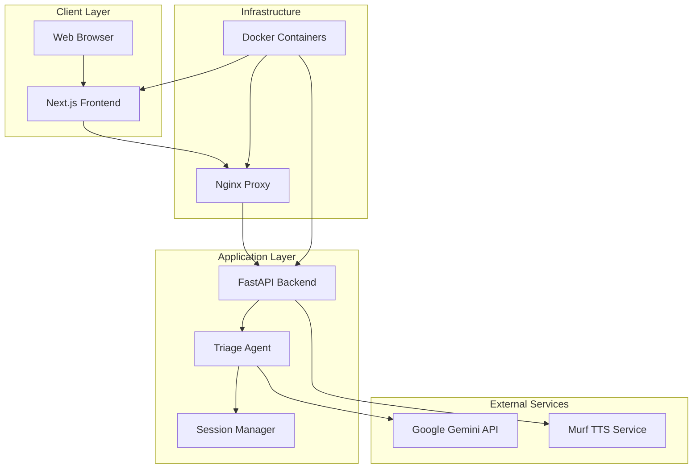
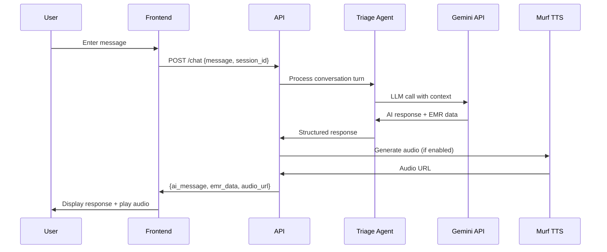
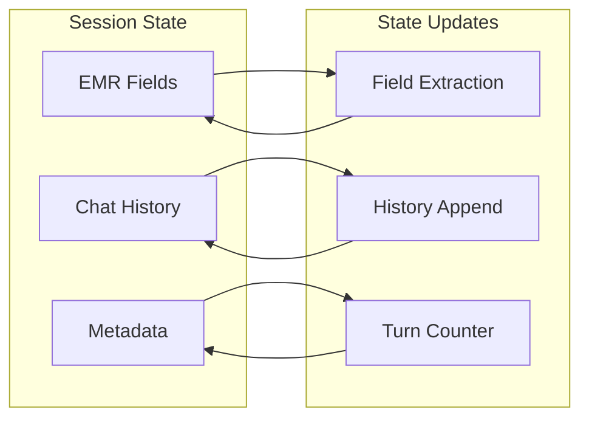
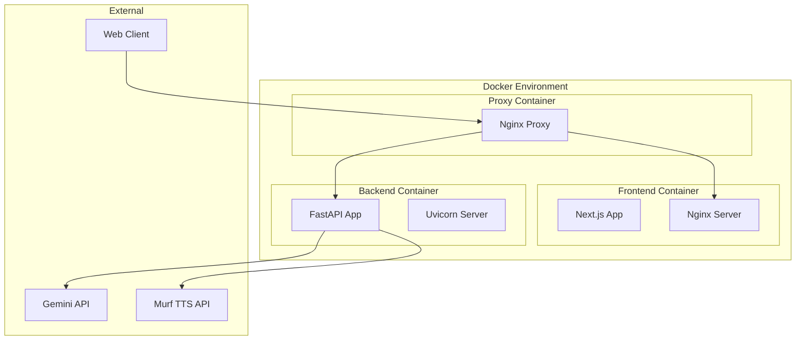

# System Architecture

This document describes the high-level architecture of the AI Triage System, including component interactions, data flows, and design patterns.

## High-Level Architecture

The system follows a modern full-stack architecture with clear separation between frontend, backend, and external services:



## Component Architecture

### Frontend Components

The frontend is built with Next.js and follows a component-based architecture:

```
Frontend Architecture
├── App Router (Next.js 13+)
│   ├── page.tsx (Main Triage Interface)
│   └── layout.tsx (Root Layout)
├── Components
│   ├── chat-interface.tsx (Conversation UI)
│   ├── emr-preview.tsx (Real-time EMR Display)
│   ├── emergency-alert.tsx (Emergency Modal)
│   ├── site-header.tsx (Navigation & Controls)
│   └── ui/ (shadcn/ui Components)
├── Hooks
│   └── Custom React hooks for state management
└── Lib
    └── Utilities and API client functions
```

**Key Frontend Patterns:**
- **State Management**: React hooks (useState) for local state
- **API Communication**: Fetch API with session-based requests
- **Component Composition**: Modular, reusable UI components
- **Event-Driven Updates**: Custom events for cross-component communication

### Backend Architecture

The backend follows a layered architecture with clear separation of concerns:

```
Backend Architecture
├── API Layer (FastAPI)
│   ├── Endpoints (/chat, /triage, /tts)
│   ├── Request/Response Models (Pydantic)
│   └── CORS & Middleware
├── Business Logic Layer
│   ├── Triage Agent (Conversation Management)
│   ├── Session Manager (State Persistence)
│   └── EMR Extractor (Data Processing)
├── Integration Layer
│   ├── Gemini Client (LLM Integration)
│   ├── Murf Client (TTS Integration)
│   └── Response Parsers
└── Data Layer
    └── In-Memory Session Storage
```

**Key Backend Patterns:**
- **Stateful Sessions**: In-memory session management with unique IDs
- **Single-Turn LLM**: Each conversation turn = one LLM API call
- **Progressive Data Extraction**: EMR fields extracted incrementally
- **Graceful Fallbacks**: Error handling with fallback responses

## Data Flow Architecture

### Conversation Flow



### Session State Management



**Session State Structure:**
```python
{
    "emr_fields": {
        "chief_complaint": str,
        "duration": str,
        "severity": str,
        "location": str,
        "associated_symptoms": list,
        "emergency_flag": bool
    },
    "chat_history": [
        {"role": "user|assistant", "content": str, "timestamp": datetime}
    ],
    "last_question": str,
    "is_complete": bool,
    "turn": int
}
```

## Integration Architecture

### External Service Integration

**Google Gemini API Integration:**
- **Purpose**: Natural language processing and conversation management
- **Model**: gemini-2.5-flash
- **Pattern**: Single-turn requests with structured JSON responses
- **Fallback**: JSON parsing with sanitization and error recovery

**Murf TTS Integration:**
- **Purpose**: Text-to-speech audio generation
- **Service**: Cloud-based API at external endpoint
- **Pattern**: Async audio generation with URL response
- **Fallback**: Text-only mode if TTS unavailable

### Deployment Architecture



**Deployment Patterns:**
- **Containerization**: Docker containers for each service
- **Reverse Proxy**: Nginx for request routing and static file serving
- **Service Discovery**: Docker DNS for inter-container communication
- **Base Path Routing**: `/intelligent-triage/` prefix for proxy deployment

## Scalability Considerations

### Current Limitations
- **In-Memory Sessions**: Limited to single server instance
- **Synchronous Processing**: Blocking API calls during LLM requests
- **No Persistence**: Sessions lost on server restart

### Scaling Strategies
- **Session Storage**: Redis or database for distributed sessions
- **Async Processing**: Background task queues for LLM calls
- **Load Balancing**: Multiple backend instances with shared state
- **Caching**: Response caching for common queries

## Security Architecture

### Current Security Measures
- **API Key Management**: Environment variable storage
- **CORS Configuration**: Controlled cross-origin access
- **Input Validation**: Pydantic models for request validation
- **Container Isolation**: Docker container security boundaries

### Security Considerations
- **Data Privacy**: No persistent storage of medical data
- **API Rate Limiting**: Not implemented (consider for production)
- **Authentication**: Not implemented (suitable for demo/POC)
- **HTTPS**: Required for production deployment

## Performance Architecture

### Frontend Performance
- **Static Export**: Pre-built HTML/CSS/JS for fast loading
- **Component Optimization**: React best practices for re-rendering
- **Asset Optimization**: Tailwind CSS purging and Next.js optimization

### Backend Performance
- **Async Framework**: FastAPI with async/await support
- **Connection Pooling**: HTTP client connection reuse
- **Response Streaming**: Structured responses for real-time updates

### Monitoring Points
- **API Response Times**: Track LLM call latency
- **Session Memory Usage**: Monitor in-memory session growth
- **External Service Health**: TTS and Gemini API availability
- **Container Resource Usage**: CPU and memory monitoring

## Technology Decisions

### Why Next.js?
- **Full-Stack Framework**: Integrated frontend and API routes
- **Static Export**: Suitable for containerized deployment
- **TypeScript Support**: Type safety for complex state management
- **Component Ecosystem**: Rich UI component library (shadcn/ui)

### Why FastAPI?
- **Async Support**: Non-blocking I/O for external API calls
- **Automatic Documentation**: OpenAPI schema generation
- **Type Safety**: Pydantic models for request/response validation
- **Performance**: High-performance Python web framework

### Why In-Memory Sessions?
- **Simplicity**: No database setup required for POC
- **Performance**: Fast session access and updates
- **Stateful Conversations**: Natural fit for conversation management
- **Demo Suitability**: Appropriate for proof-of-concept scope

This architecture provides a solid foundation for the AI Triage System while maintaining flexibility for future enhancements and scaling requirements.