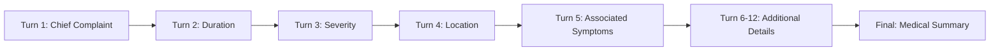
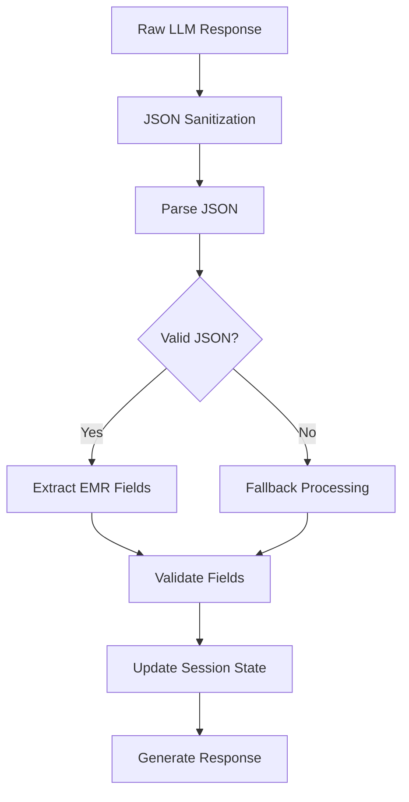

# Data and Models Documentation

This document describes the data structures, schemas, and models used throughout the AI Triage System, including EMR fields, session management, and data flows.

## EMR Data Model

### Core EMR Schema

The Electronic Medical Record (EMR) data structure captures essential patient information during the triage process:

```typescript
interface EMRData {
  chief_complaint?: string;        // Primary reason for visit
  duration?: string;               // How long symptoms present
  severity?: string;               // Intensity rating (1-10 or descriptive)
  location?: string;               // Anatomical location of symptoms
  onset?: string;                  // When/how symptoms started
  associated_symptoms?: string[];  // Related symptoms
  triggers?: string;               // What worsens symptoms
  relief_factors?: string;         // What improves symptoms
  emergency_flag?: boolean;        // Critical condition detected
  medical_summary?: string;        // Generated clinical summary
}
```

### EMR Field Definitions

| Field | Type | Description | Examples |
|-------|------|-------------|----------|
| `chief_complaint` | string | Primary symptom or concern | "severe headache", "chest pain", "fever" |
| `duration` | string | Time symptoms have been present | "3 days", "2 hours", "1 week" |
| `severity` | string | Intensity or severity rating | "8/10", "mild", "severe", "moderate" |
| `location` | string | Anatomical location | "right temple", "center chest", "lower back" |
| `onset` | string | How symptoms began | "sudden", "gradual", "after exercise" |
| `associated_symptoms` | array | Related symptoms | ["nausea", "dizziness"], ["shortness of breath"] |
| `triggers` | string | Aggravating factors | "movement", "bright lights", "stress" |
| `relief_factors` | string | Alleviating factors | "rest", "medication", "heat application" |
| `emergency_flag` | boolean | Emergency condition detected | true, false |
| `medical_summary` | string | Clinical assessment | Generated narrative summary |

### EMR Data Evolution

EMR data is extracted progressively during conversation:



**Example EMR Evolution:**

**Turn 1:**
```json
{
  "chief_complaint": "headache"
}
```

**Turn 3:**
```json
{
  "chief_complaint": "severe headache",
  "duration": "3 days",
  "severity": "8/10"
}
```

**Turn 6:**
```json
{
  "chief_complaint": "severe headache",
  "duration": "3 days", 
  "severity": "8/10",
  "location": "right temple",
  "associated_symptoms": ["nausea", "light sensitivity"],
  "triggers": "bright lights"
}
```

## Session Data Model

### Session State Schema

```typescript
interface SessionState {
  emr_fields: EMRData;             // Extracted medical data
  chat_history: Message[];         // Conversation history
  last_question?: string;          // Last AI question
  is_complete: boolean;            // Triage completion status
  turn: number;                    // Current conversation turn
  created_at: string;              // Session creation timestamp
  updated_at: string;              // Last update timestamp
}
```

### Message Schema

```typescript
interface Message {
  id: string;                      // Unique message identifier
  role: 'user' | 'assistant';      // Message sender
  content: string;                 // Message text content
  timestamp: Date;                 // Message timestamp
  audio_url?: string;              // Optional audio URL
}
```

### Session Management

**Session Lifecycle:**
1. **Creation**: New session with unique ID
2. **Active**: Conversation in progress (turns 1-12)
3. **Complete**: Triage finished, summary generated
4. **Expired**: Session timeout or server restart

**Session Storage:**
```python
# In-memory session storage
sessions: Dict[str, SessionState] = {}

# Session key format
session_id = f"session_{timestamp}_{random_string}"
```

## API Request/Response Models

### Chat Request Model

```python
from pydantic import BaseModel
from typing import Optional

class ChatRequest(BaseModel):
    message: str                     # User message content
    session_id: Optional[str] = None # Session identifier
```

### Chat Response Model

```python
class ChatResponse(BaseModel):
    ai_message: str                  # AI response message
    emr_data: EMRData               # Current EMR state
    status: str                     # Session status
    session_id: str                 # Session identifier
    audio_url: Optional[str] = None # TTS audio URL
```

### TTS Request Model

```python
class TTSRequest(BaseModel):
    text: str                       # Text to convert
    voice: str = "en-IN-priya"     # Voice selection
```

### Triage Request Model

```python
class TextTriageRequest(BaseModel):
    user_input: str                 # Single-turn input
```

## Data Validation Rules

### Input Validation

**Message Content:**
- **Length**: 1-1000 characters
- **Content**: Non-empty, printable characters
- **Encoding**: UTF-8 text

**Session ID:**
- **Format**: `session_` prefix + timestamp + random string
- **Length**: 20-50 characters
- **Characters**: Alphanumeric and underscores only

### EMR Field Validation

**Chief Complaint:**
- **Length**: 1-200 characters
- **Content**: Descriptive medical complaint
- **Required**: Yes (extracted from first message)

**Duration:**
- **Format**: Number + time unit (e.g., "3 days", "2 hours")
- **Range**: Reasonable medical timeframes
- **Required**: High priority for extraction

**Severity:**
- **Numeric**: 1-10 scale
- **Descriptive**: "mild", "moderate", "severe"
- **Mixed**: "8/10", "severe (9/10)"

**Location:**
- **Anatomical**: Valid body parts/regions
- **Descriptive**: "left side", "upper right", "center"
- **Multiple**: Array for multiple locations

## Data Processing Pipeline

### LLM Response Processing



### JSON Sanitization Process

```python
def _sanitize_json_text(text: str) -> str:
    """Clean LLM output for JSON parsing."""
    # Remove code fences
    if text.startswith('```'):
        lines = text.split('\n')
        text = '\n'.join(lines[1:-1])
    
    # Replace smart quotes
    text = text.replace('"', '"').replace('"', '"')
    
    # Remove trailing commas
    text = text.replace(',\n}', '\n}')
    
    return text
```

### EMR Field Extraction

```python
def extract_emr_fields(llm_response: dict) -> EMRData:
    """Extract EMR fields from LLM response."""
    emr_data = EMRData()
    
    # Extract each field with validation
    if 'chief_complaint' in llm_response:
        emr_data.chief_complaint = validate_complaint(
            llm_response['chief_complaint']
        )
    
    if 'duration' in llm_response:
        emr_data.duration = validate_duration(
            llm_response['duration']
        )
    
    # Continue for all fields...
    return emr_data
```

## Data Storage Patterns

### In-Memory Storage

**Current Implementation:**
```python
# Global session storage
sessions: Dict[str, SessionState] = {}

# Session access
def get_session(session_id: str) -> SessionState:
    return sessions.get(session_id, create_new_session())

def update_session(session_id: str, state: SessionState):
    sessions[session_id] = state
```

**Advantages:**
- Fast access and updates
- No database setup required
- Simple implementation for POC

**Limitations:**
- Data lost on server restart
- Memory usage grows with sessions
- No persistence across deployments

### Future Storage Options

**Redis Implementation:**
```python
import redis
import json

redis_client = redis.Redis(host='localhost', port=6379, db=0)

def store_session(session_id: str, state: SessionState):
    redis_client.setex(
        f"session:{session_id}",
        3600,  # 1 hour TTL
        json.dumps(state.dict())
    )

def get_session(session_id: str) -> SessionState:
    data = redis_client.get(f"session:{session_id}")
    if data:
        return SessionState(**json.loads(data))
    return create_new_session()
```

**Database Schema (PostgreSQL):**
```sql
CREATE TABLE sessions (
    id VARCHAR(50) PRIMARY KEY,
    emr_data JSONB,
    chat_history JSONB,
    is_complete BOOLEAN DEFAULT FALSE,
    turn_count INTEGER DEFAULT 0,
    created_at TIMESTAMP DEFAULT NOW(),
    updated_at TIMESTAMP DEFAULT NOW()
);

CREATE INDEX idx_sessions_created_at ON sessions(created_at);
CREATE INDEX idx_sessions_status ON sessions(is_complete);
```

## Data Export Formats

### EMR Export (JSON)

```json
{
  "session_id": "session_1642234567_abc123",
  "timestamp": "2024-01-15T10:30:00Z",
  "patient_data": {
    "chief_complaint": "severe chest pain",
    "duration": "1 hour",
    "severity": "9/10",
    "location": "center chest",
    "onset": "sudden while at rest",
    "associated_symptoms": ["shortness of breath", "nausea", "sweating"],
    "triggers": "none identified",
    "relief_factors": "none effective",
    "emergency_flag": true
  },
  "clinical_assessment": {
    "medical_summary": "Patient presents with acute onset severe chest pain...",
    "triage_level": "emergent",
    "recommendations": "Immediate emergency department evaluation"
  },
  "conversation_metadata": {
    "total_turns": 4,
    "completion_status": "emergency_detected",
    "ai_confidence": "high"
  }
}
```

### EMR Export (HL7 FHIR)

```json
{
  "resourceType": "Encounter",
  "id": "session_1642234567_abc123",
  "status": "in-progress",
  "class": {
    "system": "http://terminology.hl7.org/CodeSystem/v3-ActCode",
    "code": "EMER",
    "display": "emergency"
  },
  "reasonCode": [
    {
      "coding": [
        {
          "system": "http://snomed.info/sct",
          "code": "29857009",
          "display": "Chest pain"
        }
      ],
      "text": "severe chest pain"
    }
  ],
  "period": {
    "start": "2024-01-15T10:30:00Z"
  }
}
```

### CSV Export Format

```csv
session_id,timestamp,chief_complaint,duration,severity,location,emergency_flag,medical_summary
session_123,2024-01-15T10:30:00Z,"chest pain","1 hour","9/10","center chest",true,"Acute chest pain requiring emergency evaluation"
session_124,2024-01-15T11:00:00Z,"headache","3 days","6/10","bilateral",false,"Tension headache, recommend follow-up with primary care"
```

## Data Privacy and Security

### Data Handling Principles

**Privacy by Design:**
- No persistent storage of medical data
- Session-based temporary storage only
- Automatic data cleanup on session end

**Data Minimization:**
- Collect only necessary medical information
- No personal identifiers stored
- Focus on symptoms, not patient identity

**Security Measures:**
- In-memory storage (no disk persistence)
- No logging of sensitive medical data
- Secure API communication (HTTPS in production)

### Compliance Considerations

**HIPAA Compliance (Future):**
- Implement audit logging
- Add user authentication
- Encrypt data in transit and at rest
- Implement access controls

**GDPR Compliance:**
- Right to erasure (session deletion)
- Data portability (export functionality)
- Consent management
- Data processing transparency

## Data Quality and Validation

### Quality Metrics

**Completeness:**
- Percentage of EMR fields populated
- Required vs. optional field completion
- Conversation turn efficiency

**Accuracy:**
- LLM extraction accuracy
- Field validation success rate
- Emergency detection precision/recall

**Consistency:**
- Field format standardization
- Terminology consistency
- Data type validation

### Validation Rules

```python
def validate_emr_data(emr: EMRData) -> List[str]:
    """Validate EMR data quality."""
    errors = []
    
    # Chief complaint validation
    if not emr.chief_complaint or len(emr.chief_complaint) < 3:
        errors.append("Chief complaint too short")
    
    # Duration validation
    if emr.duration and not re.match(r'\d+\s+(day|hour|week|month)', emr.duration):
        errors.append("Invalid duration format")
    
    # Severity validation
    if emr.severity:
        if not (re.match(r'\d+/10', emr.severity) or 
                emr.severity.lower() in ['mild', 'moderate', 'severe']):
            errors.append("Invalid severity format")
    
    return errors
```

This data and models documentation provides comprehensive coverage of the system's data structures and processing patterns. For implementation details, refer to the API Documentation and Architecture guides.