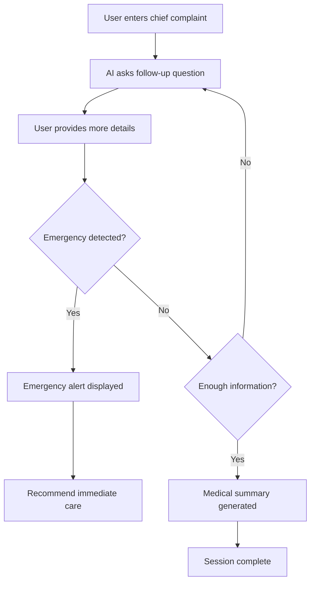

# Usage and Workflows Guide

This guide explains how to use the AI Triage System, covering user workflows, administrative tasks, and common operations.

## User Interface Overview

### Main Interface Components

The triage interface consists of several key components:

```
┌─────────────────────────────────────────────────────────────┐
│ Site Header                                                 │
│ [AI Triage] [Voice Mode Toggle] [New Session]              │
├─────────────────────────────────────────────────────────────┤
│ Chat Interface          │ EMR Preview                       │
│                        │                                   │
│ [Conversation History] │ [Real-time EMR Data]              │
│                        │                                   │
│ [Message Input]        │ [Medical Summary]                 │
└─────────────────────────────────────────────────────────────┘
```

**Component Functions:**
- **Chat Interface**: Main conversation area with message history and input
- **EMR Preview**: Real-time display of extracted medical data
- **Voice Mode Toggle**: Enable/disable text-to-speech audio
- **New Session Button**: Start fresh triage conversation

## Core User Workflows

### 1. Basic Triage Session

#### Starting a Conversation
1. **Navigate** to the application URL
2. **Enter initial complaint** in the message input field
3. **Click Send** or press Enter to begin

**Example Initial Messages:**
- "I have a severe headache"
- "My chest hurts when I breathe"
- "I've been feeling dizzy all morning"
- "I have a fever and sore throat"

#### Conversation Flow


#### Typical Question Progression
1. **Chief Complaint**: "What brings you in today?"
2. **Duration**: "How long have you been experiencing this?"
3. **Severity**: "On a scale of 1-10, how would you rate the pain?"
4. **Location**: "Where exactly do you feel the pain?"
5. **Associated Symptoms**: "Are you experiencing any other symptoms?"
6. **Triggers**: "What makes it better or worse?"
7. **Impact**: "How is this affecting your daily activities?"

### 2. Emergency Detection Workflow

#### Automatic Emergency Detection
The system continuously monitors for emergency symptoms during conversation:

**Emergency Triggers:**
- Chest pain or pressure
- Severe difficulty breathing
- Loss of consciousness
- Uncontrolled bleeding
- Signs of stroke
- Severe allergic reactions

#### Emergency Alert Response
When emergency detected:
1. **Immediate Alert**: Red emergency modal appears
2. **Session Lock**: Further conversation disabled
3. **Clear Instructions**: "Seek immediate medical attention"
4. **Emergency Services**: Recommendation to call 911/emergency services

```
┌─────────────────────────────────────────┐
│ ⚠️  EMERGENCY DETECTED                   │
│                                         │
│ Based on your symptoms, you may need    │
│ immediate medical attention.            │
│                                         │
│ Please call 911 or go to the nearest   │
│ emergency room immediately.             │
│                                         │
│ [Call 911] [Find ER] [Dismiss]         │
└─────────────────────────────────────────┘
```

### 3. Voice Mode Workflow

#### Enabling Voice Mode
1. **Click** the voice toggle in the header
2. **Allow** microphone permissions if prompted
3. **Speak** responses instead of typing
4. **Listen** to AI responses as audio

#### Voice Interaction Features
- **Text-to-Speech**: AI responses played as audio
- **Voice Selection**: Default Indian English female voice
- **Audio Controls**: Play/pause audio responses
- **Fallback**: Text display remains available

### 4. Session Management

#### Starting New Session
1. **Click** "New Session" button in header
2. **Confirm** if current session has data
3. **Begin** fresh conversation with clean state

#### Session Persistence
- **Browser Session**: Data persists during browser session
- **Page Refresh**: Session continues with same session ID
- **New Tab**: Creates new session with different ID
- **Server Restart**: All sessions lost (in-memory storage)

## EMR Data Workflow

### Real-Time Data Extraction

As the conversation progresses, the system extracts structured medical data:

#### EMR Fields Captured
| Field | Description | Example |
|-------|-------------|---------|
| **Chief Complaint** | Primary reason for visit | "Severe headache" |
| **Duration** | How long symptoms present | "3 days" |
| **Severity** | Intensity rating | "8/10" |
| **Location** | Where symptoms occur | "Right temple" |
| **Onset** | When symptoms started | "Sudden onset" |
| **Associated Symptoms** | Related symptoms | ["nausea", "light sensitivity"] |
| **Triggers** | What worsens symptoms | "Bright lights" |
| **Relief Factors** | What helps | "Dark room, rest" |
| **Emergency Flag** | Critical condition detected | true/false |

#### EMR Preview Display
```json
{
  "chief_complaint": "Severe headache",
  "duration": "3 days",
  "severity": "8/10",
  "location": "Right temple",
  "associated_symptoms": ["nausea", "light sensitivity"],
  "emergency_flag": false,
  "medical_summary": "Patient presents with severe right-sided headache..."
}
```

### Medical Summary Generation

At session completion, the system generates a comprehensive medical summary:

**Summary Components:**
- **Symptom Overview**: Concise description of presenting symptoms
- **Clinical Assessment**: Analysis of symptom pattern and severity
- **Recommendations**: Suggested next steps for care
- **Urgency Level**: Triage priority (routine, urgent, emergent)

## Administrative Workflows

### API Usage

#### Direct API Access
For integration with other systems, use the REST API endpoints:

```bash
# Start new triage session
curl -X POST http://localhost:9001/chat \
  -H "Content-Type: application/json" \
  -d '{
    "message": "I have chest pain",
    "session_id": "unique-session-id"
  }'

# Continue conversation
curl -X POST http://localhost:9001/chat \
  -H "Content-Type: application/json" \
  -d '{
    "message": "It started an hour ago",
    "session_id": "unique-session-id"
  }'

# Get medical summary
curl -X GET "http://localhost:9001/triage/summary?session_id=unique-session-id"
```

#### Response Format
```json
{
  "ai_message": "I understand you're experiencing chest pain...",
  "emr_data": {
    "chief_complaint": "chest pain",
    "duration": "1 hour",
    "emergency_flag": true
  },
  "status": "emergency_detected",
  "medical_summary": "Patient reports acute chest pain...",
  "audio_url": "http://tts-service/audio/response.mp3"
}
```

### Monitoring and Logging

#### Health Checks
```bash
# Backend health
curl http://localhost:9001/docs

# TTS service health
curl http://localhost:9001/tts/health

# Container status
docker-compose ps
```

#### Log Monitoring
```bash
# View all logs
docker-compose logs -f

# Backend logs only
docker-compose logs -f backend

# Frontend logs only
docker-compose logs -f frontend
```

## Common Use Cases

### 1. Routine Symptom Assessment
**Scenario**: Patient with mild, non-urgent symptoms
- **Duration**: 5-8 conversation turns
- **Outcome**: Structured EMR data + recommendation for routine care
- **Example**: Cold symptoms, minor injuries, routine check-up needs

### 2. Urgent Care Triage
**Scenario**: Patient with concerning but non-emergency symptoms
- **Duration**: 8-12 conversation turns
- **Outcome**: Detailed assessment + urgent care recommendation
- **Example**: Persistent fever, severe pain, concerning changes

### 3. Emergency Detection
**Scenario**: Patient with critical symptoms
- **Duration**: 1-3 conversation turns
- **Outcome**: Immediate emergency alert + 911 recommendation
- **Example**: Chest pain, stroke symptoms, severe allergic reaction

### 4. Telemedicine Integration
**Scenario**: Healthcare provider using system for remote triage
- **Process**: 
  1. Provider initiates session for patient
  2. Guides patient through conversation
  3. Reviews EMR data in real-time
  4. Makes clinical decisions based on structured data

## Error Handling and Troubleshooting

### Common User Issues

#### Issue: AI Not Responding
**Symptoms**: Message sent but no AI response
**Solutions**:
1. Check internet connection
2. Refresh page and try again
3. Start new session
4. Contact administrator if persistent

#### Issue: Audio Not Playing
**Symptoms**: Voice mode enabled but no audio
**Solutions**:
1. Check browser audio permissions
2. Verify speakers/headphones working
3. Try different browser
4. Use text-only mode as fallback

#### Issue: EMR Data Not Updating
**Symptoms**: Conversation progressing but EMR preview empty
**Solutions**:
1. Continue conversation (data may appear later)
2. Refresh page to reload session
3. Check browser console for errors
4. Start new session if needed

### System Status Indicators

#### Connection Status
- **Green**: System operational, all services connected
- **Yellow**: Partial functionality, some services unavailable
- **Red**: System error, unable to process requests

#### Session Status
- **Active**: Conversation in progress
- **Complete**: Triage finished, summary available
- **Emergency**: Emergency detected, immediate action required
- **Error**: System error, session may need restart

## Best Practices

### For Patients
1. **Be Specific**: Provide detailed symptom descriptions
2. **Be Honest**: Answer questions accurately for proper assessment
3. **Follow Instructions**: Heed emergency recommendations immediately
4. **Ask Questions**: Clarify if AI questions are unclear

### For Healthcare Providers
1. **Review EMR Data**: Use structured data to supplement clinical assessment
2. **Validate Information**: Confirm AI-extracted data with patient
3. **Clinical Judgment**: Use system as aid, not replacement for clinical decision-making
4. **Emergency Protocols**: Always follow institutional emergency procedures

### For Administrators
1. **Monitor Performance**: Track response times and error rates
2. **Update API Keys**: Rotate keys regularly for security
3. **Backup Sessions**: Consider persistent storage for production use
4. **Scale Resources**: Monitor usage and scale infrastructure as needed

This usage guide provides comprehensive coverage of system workflows and operations. For technical details, refer to the API Documentation and Architecture guides.